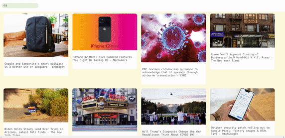

#### REACT NEWS API

<!-- <ul>

<li>
kensuke Koike collages
</li>

</ul> -->

### Extra dependencies

```javascript
npm i --save lodash
```

#### DEBOUNCE - LODASH LIBRARY

```javascript
import { debounce } from "lodash";
```

#### Debounce Explained – How to Make Your JavaScript Wait For Your User To Finish Typing

<p>

Say that you have a function named myFunc that gets called each time you type
something into an input field. After going through the requirements for your project,
you decide that you want to change the experience.

Instead, you want myFunc to execute when at least 2 seconds have passed since the last
time you typed something in.

This is where a debounce can comes into play. Instead of passing myFunc to the event
listener, you would pass in the debounce. The debounce itself would then take myFunc
as an argument, along with the number 2000.

</p>


<br>

[](https://www.freecodecamp.org/news/debounce-explained-how-to-make-your-javascript-wait-for-your-user-to-finish-typing-2/
)

<br>
<br>